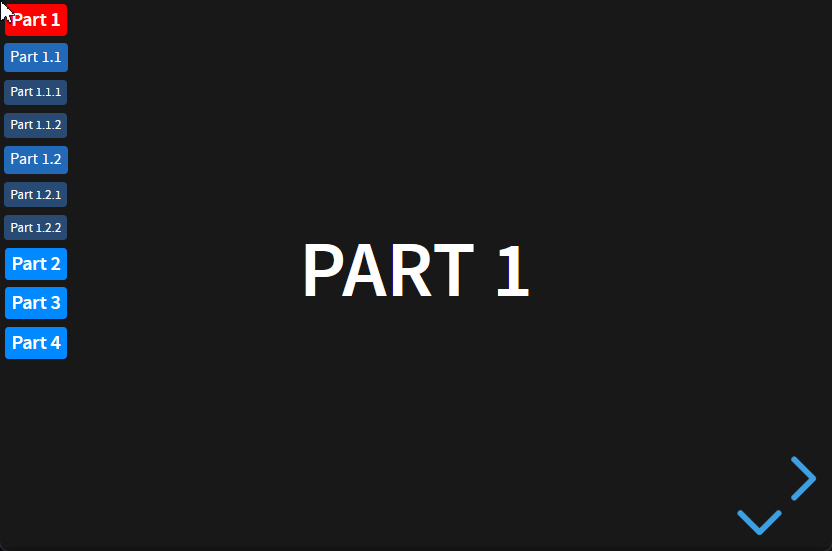
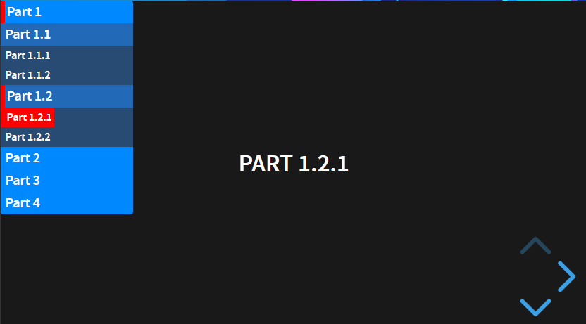
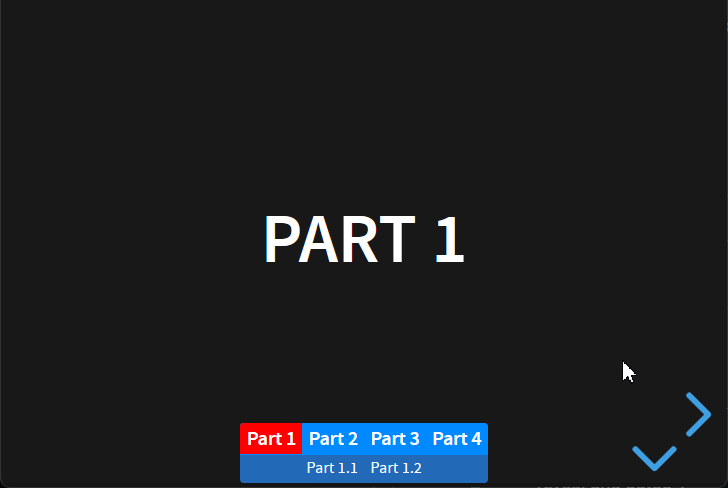
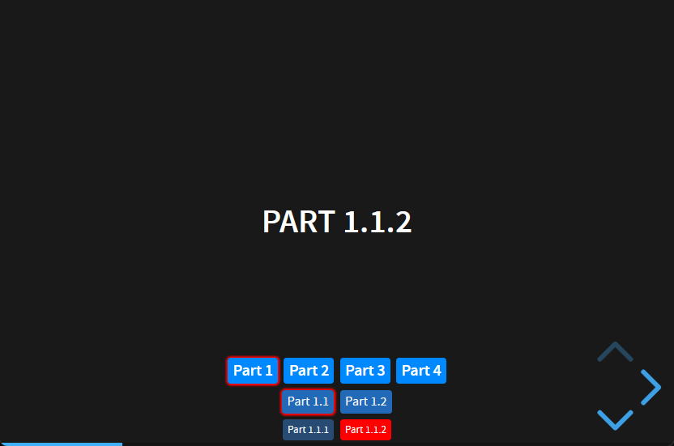

<div align="center">
<h1>AuTOC for Reveal.js</h1>
  <p>
    An Automatic Table of Content for your Reveal.js presentations
  </p>
  <!-- Badges -->
	<p>
		<a href="">
			
		</a>
		<a href="https://github.com/bazmap/AuTOC-for-Reveal.js/graphs/contributors">
			
		</a>
		<a href="https://github.com/bazmap/AuTOC-for-Reveal.js/issues/">
			
		</a>
	</p>
	<p>
		<a href="licence.md">
			 
		</a>
		<a href="https://github.com/bazmap/AuTOC-for-Reveal.js/network/members">
			
		</a>
		<a href="https://github.com/bazmap/AuTOC-for-Reveal.js/stargazers">
			
		</a>
	</p>
</div>


## 📔 Table of Contents

- [📔 Table of Contents](#-table-of-contents)
- [🌟 What is AuTOC](#-what-is-autoc)
- [📖 User documentation](#-user-documentation)
	- [🚀 Installation](#-installation)
	- [🧰 Configuration](#-configuration)
	- [🎨 Style](#-style)
	- [⚡️ How to use](#️-how-to-use)
- [👋 Contributing](#-contributing)
- [📜 Licence](#-licence)


## 🌟 What is AuTOC
AuTOC stand for "Automatic Table Of Content". It creates a dynamic TOC into your Reveal.js presentation.  
It's based on specific elements used into the presentation such as `h1`, `h2` or `h3` and structured as a menu with clickable elements to jump to specific parts.  
TOC items are highlighted to see the progress.

Vertical - boxed layout :  



Vertical - plain layout :  



Horizontal - plain layout :  



Horizontal - boxed layout :  




## 📖 User documentation
### 🚀 Installation
Follow these 3 simple steps :
1. Copy the `plugin\AuTOC` directory content from this repository into the `plugin\AuTOC` directory of your Reveal.js presentation.

2. Include the script into your presentation file :
```html
<script src="/plugin/AuTOC/AuTOC.js"></script>
```

3. Include the plugin into the `Reveal.initialize` :
```javascript
Reveal.initialize({
	plugins: [ 
		AuTOC
	]
});
```
That's it, you should see the AuTOC !


### 🧰 Configuration
AuTOC support multiple parameters to change the layout.  
Just add the `AuTOC` key into the `Reveal.initialize` :
```javascript
Reveal.initialize({
	plugins: [ 
		AuTOC
	],
	AuTOC: {
		tagList: 'h1,h2,h3', // string
		// DOM elements to use for the table of contents
		// String of elements separated by comma 
		// The element order dertemine the hierarchy
		// Default to 'h1,h2,h3'
		visibleInit: true, // boolean
		// TOC visible at start
		// Default to true
		layout: 'vertical', // string
		// Menu layout : 'vertical', 'horizontal'
		// Default to 'vertical'
		style: 'box', // string
		// Menu style : 'box', 'plain'
		// Default to 'box'
		subAlwaysVisible: false, // boolean
		// In vertical layout only, all sub-elements are always displayed
		// Default to false
		horizontalPosition: 'left', // string
		// In vertical layout only, TOC position in the page : 'left', 'right'
		// Default to left
		verticalPosition: 'top', // string
		// TOC position in the page : 'top', 'bottom'
		// Default to top for layout = vertical and bottom for layout = horizontal
		linksAlign: 'center', // string
		// Links alignment : 'left', 'right', 'center'
		// Default to center
	}
});
```

The following parameters can be used :
- `tagList` : string 
  - DOM elements to use for the table of contents
  - String of elements separated by comma
  - The element order dertemine the hierarchy
  - Default to `'h1,h2,h3'`
- `visibleInit` : boolean
  - TOC visible at start
  - Default to `true`
- `layout` : string
  - Menu layout : `'vertical'`, `'horizontal'`
  - Default to `'vertical'`
- `style` : string
  - Menu style : `'box'`, `'plain'`
  - Default to `'box'`
- `subAlwaysVisible` : boolean
  - In vertical layout only, all sub-elements are always displayed.
  - Default to `false`
- `horizontalPosition` : string
  - In vertical layout only, TOC horizontal position in the page : `'left'`, `'right'`
  - Default to `'left'`
- `verticalPosition` : string
  - TOC vertical position in the page : `'top'`, `'bottom'`
  - Default :
    - for layout = vertical : `'top'`
    - for layout = horizontal : `'bottom'`
- `linksAlign` : string
  - Links alignment : `'left'`, `'right'`, `'center'` 
  - Default to `'center'`


### 🎨 Style
CSS can be modify, thoses variables are used :

```css
#AuTOC {
	--autoc-main-color: #0088FF;
	--autoc-active-color:#ff0000;
	--autoc-text-color: #fff;
	--autoc-text-size: 13px;
	--autoc-border-radius: 3px;
	--autoc-max-width: 150px; /* Can be max-content to fit the content */
}
```

Colors are defined up to 6 levels of depth. If you want to define more or redefine it, use these selectors (here for level 1, just change the level number) :

```css
#AuTOC.box ul li.tagOrder-1 > a,
#AuTOC.vertical.plain li.tagOrder-1,
#AuTOC.horizontal.plain #tagOrder-1.menu-level {
	background-color: color-mix(in oklab, var(--autoc-main-color) 100%, rgb(35, 35, 35));
	font-size: 1.2em;
	font-weight: bold;
}
```


### ⚡️ How to use
To use the plugin, just follow your presentation, the part displayed will be highlighted.
You can click on items to jump to the linked part.

> [!TIP]
> Press the `a` key to disable/enable the AuTOC.


## 👋 Contributing
Contributions are what make the open source community such an amazing place to learn, inspire, and create. Any contributions you make are greatly appreciated.

If you have a suggestion that would make this better, please fork the repo and create a pull request. You can also simply open an issue with the tag "enhancement". Don't forget to give the project a star! Thanks again!

> [!IMPORTANT]
> For major changes, please open an issue first to discuss what you would like to change.

🧑‍💻 to install your environment, you can use Docker 🐳
1. Clone this repository
2. Run `docker compose up --build` into the `Docker` directory.
3. Connect to `http://localhost:8000`

This will run a node app where all modifications can be done into the `plugin/AuTOC` directory to be seen live.


## 📜 Licence
More info in the [associated file](licence.md)

